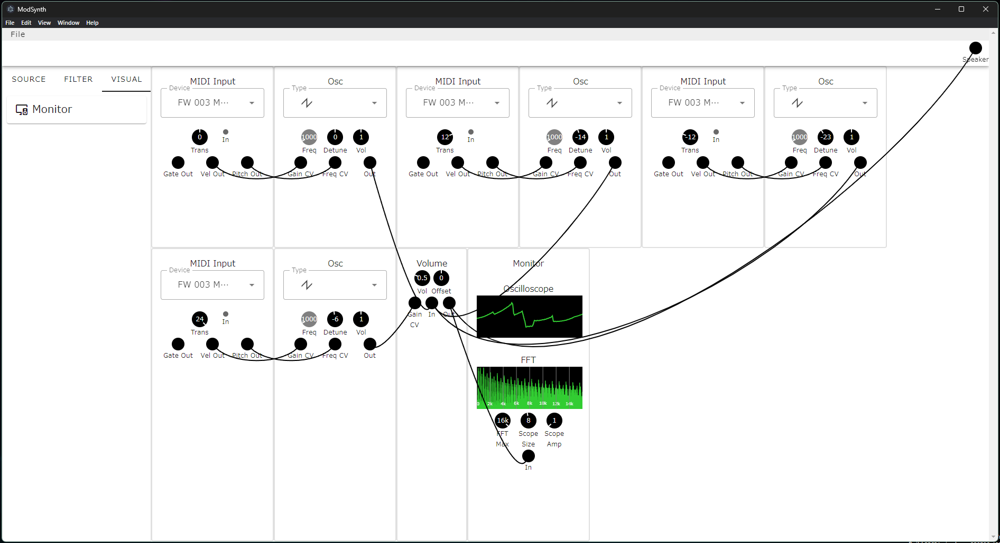

# ModSynth
Modular synthesizer app for PC



## Features
- [x] Module System
- [x] Wiring System
- [x] Keyboard Input
- [x] Audio Input
- [x] Save

## Modules
### Source
- [x] MIDI for VFO, VCO
- [x] Audio Device Input
- [x] Audio File Player
- [x] VCO
- [ ] Sequencer

### Filter
- [x] Volume
- [x] VCF
- [x] LFO
- [x] ADSR
- [x] VCA
- [x] Delay
- [x] Channel Merger/Splitter
- [x] Stereo Panner
- [x] Echo
- [x] EQ
- [x] Compressor
- [x] 3D Panner

### Visual
- [x] Monitor

## Installation
There are no pre-built binary yet.

## Building
```
npm i
npm run build
```

## Testing
```
npm i
npm run dev
```

## How to use
### Read before use
- Be careful with the volume. The oscillator output could be very loud.

### Main screen overview
```
 _______________________
|           1           |
|-----------------------|
|     |             |   |
|     |             |   |
|  2  |      3      | 4 |
|     |             |   |
|     |             |   |
|_____|_____________|___|
```

1. Navigation bar
2. Module store
3. Module case
4. Output section

### Module overview
```
 ____________
|   Title    |
|            |
|  Monitors  |
|            |
|            |
|  Controls  |
|            |
| Connectors |
|____________|
```

### How to...
#### Setup
1. Drag modules from the module store and drop into the module case.
2. Wire modules by dragging connectors.
3. Connect audio signal(s) into the output connector on the output section to output audio from your speaker.

#### Edit knob
Rotate the mouse wheel or you can input from the keyboard by clicking number and hit Enter key to apply.

#### Remove a module
Drag a module from the module case and drop into the module store.

#### Remove a wire
Click connector.
